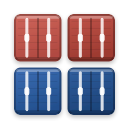
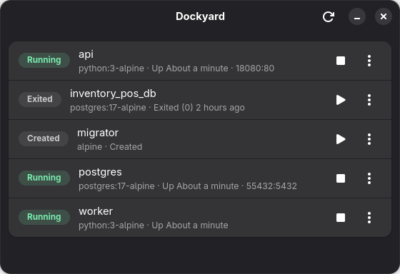
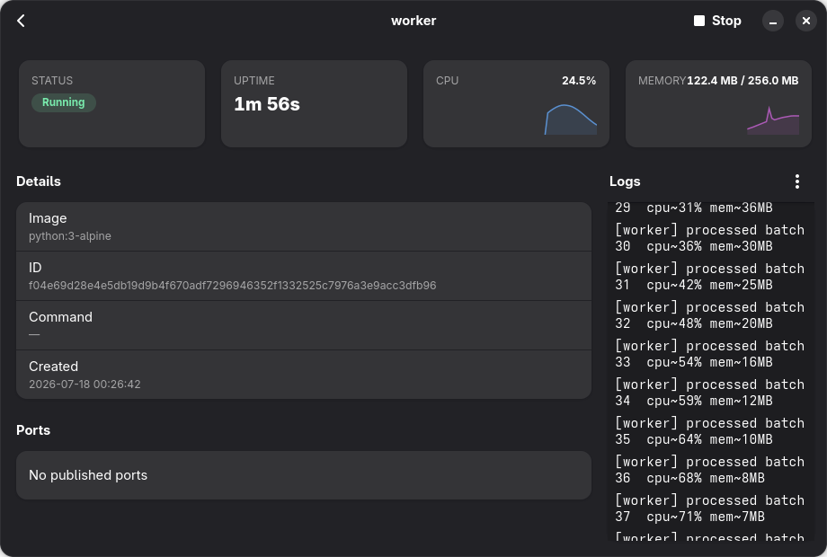

<p align="center">
  
</p>

<h1 align="center">Dockyard</h1>

<p align="center">
  A native GNOME app for managing Docker containers on your Linux desktop.
</p>

<p align="center">
  
  
  
  
</p>

---

Dockyard is a small, focused desktop app for managing the Docker containers on
your own machine — list them, start and stop them, watch their resources, and
tail their logs, all from a window that looks and behaves like a first-party
GNOME application. It is deliberately **not** Docker Desktop: one user, one
machine, no image builds, no compose, no multi-host. Just the container
management you reach for day to day, done natively.

Built with [relm4](https://relm4.org/) (the Elm architecture, in Rust),
[GTK 4](https://www.gtk.org/) + [libadwaita](https://gnome.pages.gitlab.gnome.org/libadwaita/),
and [bollard](https://docs.rs/bollard/) for the Docker API.

## Screenshots

Every container, running or stopped, with its status, ports, and one-tap start/stop:

<p align="center">
  
</p>

Open one for the detail dashboard — live CPU and memory graphs, its details and
ports, and streaming logs, in a layout that goes side-by-side as the window widens:

<p align="center">
  
</p>

## Features

- **Container list** — running *and* stopped, each an Adwaita row with name,
  image, a colour-coded status chip, and published ports. Refreshes itself every
  two seconds.
- **Lifecycle actions** — start, stop, restart, and remove (with a confirmation
  dialog). Each action shows inline progress and surfaces failures as toasts,
  never a crash.
- **Detail dashboard** — click a container for a dashboard: a status chip, live
  uptime, **CPU and memory sparklines** streamed from the Docker stats API,
  plus its image, ID, command, created time, and port mappings. The layout is
  responsive — cards reflow from 2×2 to a single row, and the details sit beside
  the logs, as the window widens.
- **Streaming logs** — follow a container's output live, embedded right in the
  detail view, with a wrap toggle and an optional timestamp column. Follows the
  tail as new lines arrive, but doesn't yank the view while you scroll back.
- **Native and adaptive** — libadwaita throughout, so light/dark mode, the
  system accent colour, and adaptive layout all come for free.
- **Light on resources** — the two-second poll pauses entirely while the window
  is hidden, so a backgrounded Dockyard costs nothing.
- **It just works** — finds the Docker socket the way the daemon expects
  (`DOCKER_HOST`, then a rootless socket under `$XDG_RUNTIME_DIR`, then the
  system socket), verifies the connection, and if Docker is unreachable it
  explains why — including the common "you're not in the `docker` group" case —
  rather than showing an empty list.

## Requirements

- **Rust** ≥ 1.93 (edition 2024)
- **GTK** ≥ 4.10 and **libadwaita** ≥ 1.5
- **librsvg** (for the icon)
- A reachable **Docker daemon** — rootful or rootless

On Arch / CachyOS:

```bash
sudo pacman -S --needed base-devel pkgconf rust gtk4 libadwaita librsvg
sudo systemctl enable --now docker.socket     # rootful
# systemctl --user enable --now docker        # rootless
```

## Build and run

```bash
cargo run                    # dev build, launches the window
RUST_LOG=debug cargo run     # same, with tracing logs on stdout
cargo build --release        # optimised binary at target/release/dockyard
```

## Install (desktop integration)

To install Dockyard as a real desktop app — its icon in the app grid and a
launcher entry — into `~/.local`, no sudo required:

```bash
make install     # builds --release, copies into ~/.local, refreshes caches
make uninstall   # removes everything it installed
make check       # fmt --check + clippy --all-targets + test (the commit bar)
```

> **Note on Wayland:** an app can't set its own window icon on Wayland — the icon
> comes from the *installed* `.desktop` file. So the icon and app-grid entry
> appear only after `make install`; `cargo run` won't show them. Launch the
> installed **Dockyard** from your app grid to see it fully dressed.

## How it works

Dockyard is Redux with a compiler: a single model, one reducer, and a view
derived from state — relm4's take on the Elm architecture. All Docker I/O runs
off the GTK main thread through relm4 commands, and bollard's types are mapped to
our own at the boundary so the UI never touches them.

- **[ARCHITECTURE.md](ARCHITECTURE.md)** — the explanation: what the pieces are,
  why they're shaped that way, the Rust patterns you'll hit, and a build log.
- **[CLAUDE.md](CLAUDE.md)** — the rulebook: the pinned stack and the hard rules
  the code holds itself to.

```
src/
  main.rs              RelmApp bootstrap, tracing, icon, the one custom stylesheet
  app.rs               root component: the store, reducer, and view
  docker/
    client.rs          socket discovery, connect, ping, thin async API wrappers
    types.rs           our Container / ContainerState / Port / ContainerDetail / Stats
  components/
    container_row.rs      a container as an adw::ActionRow
    container_detail.rs   the responsive detail dashboard (embeds the log view)
    logs_view.rs          the streaming log panel
    status_chip.rs        state → chip label + colour variant
```

## Status

**v1 is complete** — listing, lifecycle actions, the detail dashboard with live
graphs, and embedded streaming logs are all built and in daily-driver shape.
Minor additions are queued for a **v1.1**. The scope stays deliberately lean:
features get added when they're genuinely useful on one machine, not to chase
parity with Docker Desktop.

## License

Not yet licensed — a personal project. Please ask before reusing.
